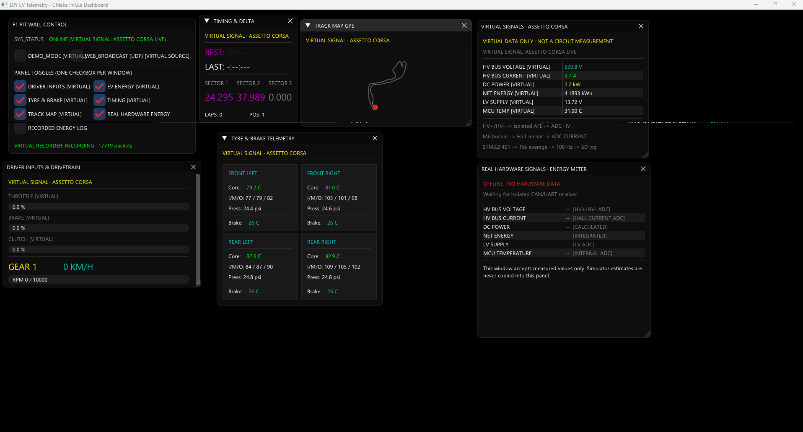
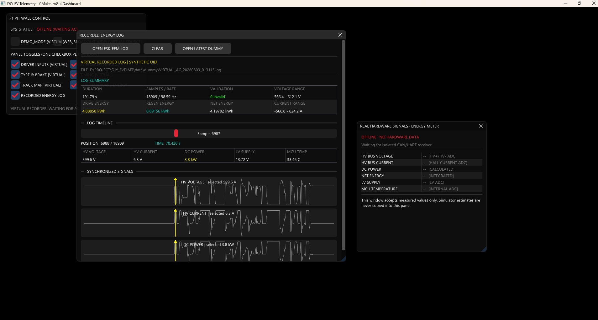

# DJY EV Telemetry

Assetto Corsa 가상 텔레메트리와 실제 EV 에너지미터 데이터를 서로 분리해 표시하는
Windows C++ 대시보드입니다. GUI는 CMake, Dear ImGui, Win32, DirectX 11로 구성됩니다.

이 프로젝트는 [ASC_TLMTSYS](https://github.com/20233332choi/ASC_TLMTSYS.git)에서 파생되었습니다.

## 화면

### 실시간 텔레메트리

가상 신호와 실제 하드웨어 신호를 별도 창으로 분리하고, 드라이버 입력·타이어·브레이크·랩타임·트랙 맵·에너지 정보를 실시간으로 표시합니다.



### 에너지 로그 열람

FSK-EEM 호환 로그의 요약값, 선택 샘플, 전압·전류·전력 파형과 타임라인 위치를 한 화면에서 확인합니다.



## 실행

프로젝트 루트의 다음 파일을 더블클릭합니다.

```text
run_dashboard.bat
```

실행 파일이 없으면 Visual Studio CMake로 자동 빌드합니다. 강제로 다시 빌드하려면:

```powershell
.\run_dashboard.bat rebuild
```

## 데이터 구분

- `VIRTUAL SIGNAL`: Assetto Corsa 공유 메모리 또는 내장 데모에서 계산한 추정값
- `REAL HARDWARE SIGNAL`: 향후 CAN/UART로 수신할 실제 회로 계측값
- 게임 패킷이 1.5초 이상 갱신되지 않으면 `OFFLINE`
- 실제 창에는 가상값을 복사하지 않으며 미연결 시 `--`를 표시

현재 실제 `fsk-energymeter` 펌웨어는 주행 중 SD 기록만 수행하므로, 실제 창의 실시간
표시에는 별도의 CAN/UART 송신 펌웨어와 수신 인터페이스가 필요합니다.

## 가상 로그 자동 기록

대시보드는 Assetto Corsa의 `AC_LIVE` 패킷을 감지하면 실제 FSK-EEM과 동일한 16-byte
레코드 형식으로 자동 기록합니다.

```text
data/dummy/VIRTUAL_AC_YYYYMMDD_HHMMSS.log
```

- 별도 기록 스레드에서 10 ms 간격(100 Hz)으로 기록
- 10개 레코드마다 파일 flush(약 100 ms)
- AC 세션 시작 시 새 로그 생성
- 세션 종료 상태가 3초 지속되면 로그 종료
- 실제 FSK-EEM과 동일한 magic, timestamp, 단위, XOR checksum 사용
- 합성 UID를 사용하므로 열람 창에서 `VIRTUAL RECORDED LOG`로 판별
- `OPEN LATEST DUMMY` 버튼으로 현재/최근 가상 로그 열기

프로그램이 종료될 때도 열린 로그를 flush하고 닫습니다. `data/dummy/*.log`는 생성 데이터라
Git에서 제외됩니다.

## 프로젝트 구조

```text
DJY_EvTLMT/
├─ CMakeLists.txt
├─ run_dashboard.bat        # 사용자 원클릭 실행
├─ README.md
├─ src/
│  ├─ main.cpp
│  ├─ ui/                   # ImGui 대시보드 화면
│  └─ telemetry/            # AC 공유 메모리와 통신 데이터 소스
├─ scripts/
│  └─ build.ps1             # 개발용 CMake 빌드
├─ docs/
│  └─ CAN_INTEGRATION.md
├─ third_party/
│  ├─ imgui/                # 빌드에 필요한 Dear ImGui 파일만 포함
│  └─ json/                 # nlohmann single-header JSON
├─ data/
│  └─ dummy/                # 자동 생성되는 가상 FSK-EEM 로그
```

`build/`와 `bin/`은 자동 생성되며 Git에서 제외됩니다.

## 대시보드 창

- Driver Inputs & Drivetrain `[VIRTUAL]`
- EV Energy `[VIRTUAL]`
- Tyre & Brake `[VIRTUAL]`
- Timing `[VIRTUAL]`
- Track Map `[VIRTUAL]`
- Real Hardware Energy
- Recorded Energy Log

컨트롤 창의 체크박스는 위 정보창과 1:1로 대응합니다.

`Recorded Energy Log` 창은 FSK-EEM `.log`의 체크섬을 검증하고 전압·전류·전력 파형,
선택 샘플, 소비·회생·순에너지와 손상 패킷 수를 표시합니다. 합성 UID 로그는
`VIRTUAL RECORDED LOG`, 실제 장치 UID 로그는 `MEASURED HARDWARE LOG`로 구분합니다.

## 실제 CAN 연동

CAN 하드웨어, 메시지 ID, 스케일, 상태 판정, 배선 및 펌웨어 요구사항은
[CAN 연동 문서](docs/CAN_INTEGRATION.md)를 참고하십시오.

> 대회에서 지급하거나 공식 판정에 사용하는 에너지미터의 펌웨어와 회로는 임의로
> 변경하지 마십시오. CAN 수정은 자작 계측기 또는 별도 보조 계측기에만 적용합니다.
