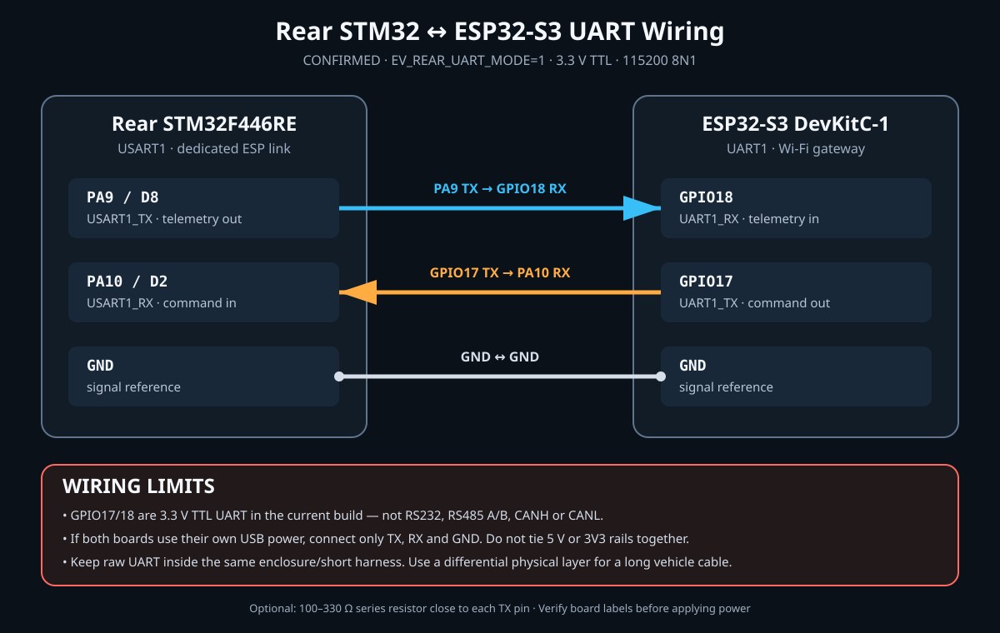

# ESP32-S3 ↔ Rear STM32 배선

> **2026-09-17 최신 카카오톡 TorqueVectoring에 PA9/PA10 USART1 송신을 추가하고 Rear에 적용·실수신 확인했다.**
> 아래 표는 기존 UART 연동 버전의 배선이다. 최신 원본과의 차이는
> [TorqueVectoring 핀맵 대조](TORQUEVECTORING_PINMAP.md)를 먼저 확인한다.

> 2026-09-13: 사용자 재배선 후 PA9 → GPIO18의 실제 UART 수신을 확인했다.
> 이어서 ESP → 같은 휴대폰 핫스팟의 PC → HTML 대시보드 무선 수신도 확인했다.
> [현재 검증 결과](ESP_UART_UDP_20260913.md). 아래 역방향 명령선은 연결되어 있지만
> 현재 ESP는 읽기 전용이므로 제어 명령을 전달하지 않는다.



## 현재 확정 구성

실제 적용한 `firmware/esp32_ev_gateway/platformio-modern.ini`는 `EV_REAR_UART_MODE=1`로
빌드된다. 따라서 GPIO17/18은 CAN이 아니라 Rear STM32 전용 3.3 V TTL UART다.

| Rear STM32F446RE | 방향 | ESP32-S3 DevKitC-1 | 역할 |
|---|---:|---|---|
| PA9 / D8 / USART1_TX | → | GPIO18 / UART1_RX | Rear 차량 텔레메트리 |
| PA10 / D2 / USART1_RX | ← | GPIO17 / UART1_TX | ESP 피트 명령 프레임 |
| GND | ↔ | GND | 신호 기준 전위 |

통신 설정은 `115200 baud, 8 data bits, no parity, 1 stop bit, no flow
control`이다.

## 벤치에서 연결하는 순서

1. STM32와 ESP32 전원을 모두 끈다.
2. GND를 먼저 연결한다.
3. TX와 RX를 교차 연결한다.
4. STM32는 ST-Link USB, ESP32는 자체 USB로 각각 전원을 공급한다.
5. 이 경우 STM32의 5 V/3V3 핀과 ESP32의 5 V/3V3 핀은 서로 연결하지 않는다.
6. ESP 로그에서 `Rear UART ready: RX GPIO18 / TX GPIO17, 115200 8N1`을
   확인하고 `rear_uart_rx`가 증가하는지 본다.

## 연결하면 안 되는 것

- GPIO17/18에 RS485 A/B, RS232 TX/RX 또는 CANH/CANL을 직접 연결하지 않는다.
- MAX3232, RS485 트랜시버 또는 CAN 트랜시버를 현재 3선 TTL UART 사이에 넣지 않는다.
- 한 보드의 5 V 신호를 다른 보드 GPIO에 넣지 않는다. 두 MCU의 UART GPIO는 3.3 V다.
- BMS의 RS485 A/B는 이 UART에 합치지 않는다. BMS는 별도 UART와 절연형 RS485
  트랜시버를 사용해야 한다.

## 전원과 노이즈

- 같은 케이스 안의 짧은 벤치 배선은 위 3선으로 시작할 수 있다.
- 선택 사항으로 각 TX 핀 가까이에 100~330 Ω 직렬 저항을 둘 수 있다.
- 인버터, 모터 상선, 고전압 DC, 접촉기 코일 및 DC-DC 스위칭 노드에서 떨어뜨린다.
- 차량 안에서 길게 배선해야 하면 TTL UART를 그대로 연장하지 않는다. 현재처럼
  양방향 통신을 유지하려면 RS422 같은 차동 full-duplex 링크를 쓰거나, 프로토콜을
  변경해 CAN/RS485를 사용한다.

## 전체 STM 구조

```text
STM32F PA12/PA11 ─ CAN 트랜시버 ─ CANH/CANL ─ CAN 트랜시버 ─ STM32R PA12/PA11
                                                                        │
                                                       USART1 PA9/PA10 │ 3.3 V TTL UART
                                                                        v
                                                        ESP32 GPIO18/17
```

Front와 Rear 사이 CAN은 두 보드의 PA12/PA11을 CANH/CANL에 직접 연결하는 방식이
아니다. 각 STM32와 버스 사이에 3.3 V CAN 트랜시버가 필요하고, 120 Ω 종단은 버스의
물리적 양 끝에만 둔다.

## 대체 CAN 모드

ESP firmware에는 GPIO17/18을 TWAI TX/RX로 쓰는 대체 코드도 남아 있지만 현재 빌드에서는
비활성이다. CAN 모드로 바꾸려면 `EV_REAR_UART_MODE=0`, 외부 3.3 V CAN 트랜시버 및
CAN 배선으로 함께 변경해야 한다. GPIO17/18에 UART와 CAN 트랜시버를 동시에 연결하면
안 된다.
