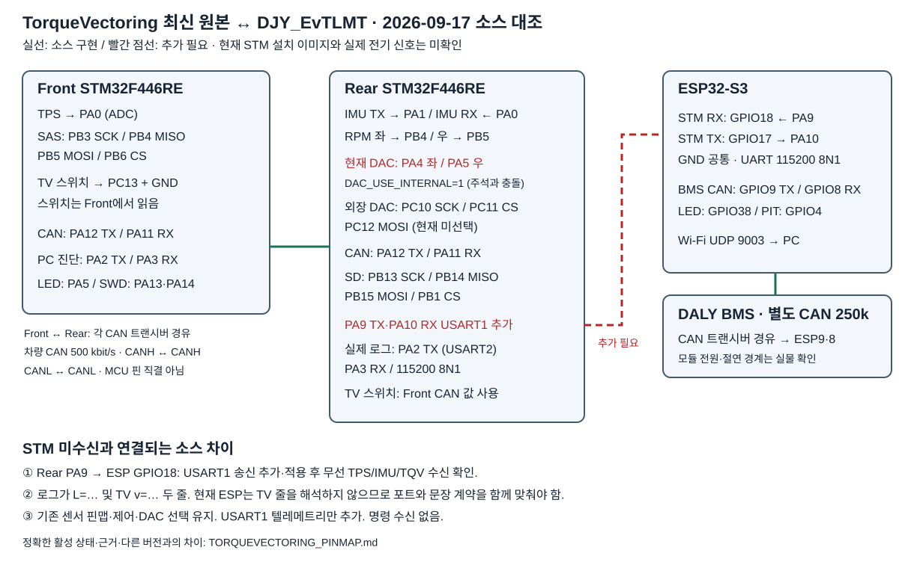

# 최신 TorqueVectoring ↔ DJY_EvTLMT 핀맵 대조

> 아래는 2026-09-17 버전의 이력입니다. 2026-09-18 추가한 `tv_stm_esp.zip`의
> 현재 소스·핀맵·보정값은 [새 통합 안내](../firmware/tv_stm_esp/README.md)를 우선합니다.
> 특히 SAS 중앙값은 1116, PID는 20/1/0이며 현재 보드에 기록한 값이라는 뜻은 아닙니다.

기준일: 2026-09-17. 사용자 지정 최신 원본은
`C:\Users\user\Documents\카카오톡 받은 파일\TorqueVectoring`의 `stm_front`, `stm_back`이다.
이 문서의 **소스 확인**은 `board_config.h`뿐 아니라 `main.c`의 초기화·호출,
`stm32f4xx_hal_msp.c`, `.ioc`, 활성 전처리 설정을 대조했다는 뜻이다.
후속 적용: Rear를 ST-Link로 백업하고 USART1 송신을 추가·기록했다. 기록 검증 및
STM → ESP → 무선 대시보드의 TPS/IMU/TQV 실수신을 확인했다. 핀 전압·도통·파형 측정은 별도다.

## PA9/PA10 송신 추가 완료

수정 전 원본은 USART2 PA2 TX로만 로그를 출력했다. 기존 제어·센서 핀맵을 유지하면서
`huart1`, USART1 초기화, PA9/PA10 AF7 및 `Debug_SendESP()`를 추가했다.
ESP는 **GPIO18 RX / GPIO17 TX, 115200 8N1**로 확장 텔레메트리를 받는다.

별도 5Hz 확장 한 줄을 인터럽트 송신하며 기존 USART2 로그 두 줄은 유지한다.
원격 피트 명령 수신은 구현하지 않는다. 백업과 빌드·검증 방법은 최신 소스 루트의 `ESP_UART.md`에 있다.

| 연결 | 최신 TorqueVectoring 상태 | DJY_EvTLMT와의 관계 |
|---|---|---|
| Rear PA9 TX → ESP GPIO18 RX | USART1 송신 적용·실수신 확인 | 115200 8N1, 5Hz |
| ESP GPIO17 TX → Rear PA10 RX | USART1 핀 초기화, 명령 처리 없음 | 현재 ESP는 읽기 전용 |
| Rear GND ↔ ESP GND | UART 신호 기준 | 사용자 배선 기준, 실물 도통 미확인 |
| Rear PA2 TX → ST-Link VCP | 소스 구현, USART2 115200 8N1 | 최신 원본의 실제 로그 출력 경로 |
| Rear PA3 RX ← ST-Link VCP | USART2 RX 초기화 | PA10과 다른 핀. ESP TX를 임의로 합치지 않음 |

PA9 배선을 유지한다. Front와 기존 제어·안전·DAC 설정은 수정하지 않았다.

## Front — STM32F446RE / stm_front

아래 핀은 MCU 핀명이다. 커넥터 번호나 선 색상을 MCU 핀명으로 대체하지 않는다.

| 기능 | Front MCU 핀 | 연결 방향 / 소스 상태 |
|---|---|---|
| TPS | PA0 / ADC1_IN0 | 페달 아날로그 출력 → Front |
| SAS SCK | PB3 / SPI1_SCK | Front → 센서 SCK |
| SAS MISO | PB4 / SPI1_MISO | 센서 데이터 → Front |
| SAS MOSI | PB5 / SPI1_MOSI | Front → 센서 |
| SAS CS | PB6 / GPIO | Front → 센서 CS |
| **TV ON/OFF 스위치** | **PC13** | Front에서 풀업 입력, GND로 닫히면 ON; CAN 0x100 바이트4 bit0 전달 |
| CAN TX | PA12 / CAN1_TX | Front → 차량 CAN 트랜시버 TXD |
| CAN RX | PA11 / CAN1_RX | 차량 CAN 트랜시버 RXD → Front |
| 상태 LED | PA5 | 온보드 LD2 |
| PC 진단 | PA2 TX / PA3 RX | USART2 / ST-Link VCP, 115200 8N1 |
| SWD | PA13 / PA14 | SWDIO / SWCLK |
| TQV·REGEN 가변 다이얼 PC0/PC1 | 이번 원본에 ADC 입력 구현 없음 | 다른 버전의 다이얼 핀맵을 적용하지 않음 |

Front PC13은 `.ioc`의 EXTI 표기와 달리 `main.c` USER CODE에서 풀업 일반 입력으로
다시 설정한다. 실제 TV 스위치 상태는 이 입력을 읽는다. `CAN_TEST_MODE=0`이다.

## Rear — STM32F446RE / stm_back

| 기능 | Rear MCU 핀 | 연결 방향 / 활성 상태 |
|---|---|---|
| IMU 수신 | **PA1 / UART4_RX** | IMU TX → Rear, 115200 8N1, DMA1 Stream2 Ch4 |
| IMU 송신 | **PA0 / UART4_TX** | Rear → IMU RX |
| 좌 RPM | **PB4 / TIM3_CH1** | 좌 속도 펄스 → Rear |
| 우 RPM | **PB5 / TIM3_CH2** | 우 속도 펄스 → Rear |
| CAN TX / RX | PA12 / PA11 | 차량 CAN 트랜시버 경유, Front와 별도 MCU |
| **현재 좌 DAC 출력** | **PA4 / DAC_CH1** | `DAC_USE_INTERNAL=1`로 선택된 출력 |
| **현재 우 DAC 출력** | **PA5 / DAC_CH2** | `DAC_USE_INTERNAL=1`로 선택된 출력 |
| 외장 MCP4822 SCK | PC10 / SPI3_SCK | SPI 초기화 존재; 현재 DAC 출력 백엔드는 아님 |
| 외장 MCP4822 CS | PC11 / GPIO | 위와 같음 |
| 외장 MCP4822 MOSI | PC12 / SPI3_MOSI | 위와 같음 |
| SD SCK / MISO / MOSI / CS | PB13 / PB14 / PB15 / PB1 | SPI2 핀 설정 존재. SD 기록 성공은 별도 검증 |
| 상태 LED | PB0 | GPIO 출력 |
| Rear PC13 | GPIO 입력 설정 잔존 | **TV 제어 스위치로 읽지 않음**; Front의 CAN 스위치 상태 사용 |
| PC 진단·현재 로그 | PA2 TX / PA3 RX | USART2 115200 8N1 |
| ESP 연동 | PA9 TX / PA10 RX | USART1 송신 추가 및 실수신 확인 |
| SWD / SWO | PA13 / PA14 / PB3 | 디버그 핀, Front PB3 SAS와 서로 다른 MCU |

**DAC 주석과 설정이 충돌한다.** `board_config.h`의 “PA4/PA5 미사용” 문구보다
`vehicle_params.h:251`의 `DAC_USE_INTERNAL=1`과 실제 DAC 초기화/호출을 기준으로 했다.
`dac_output.c` 상단의 외장 DAC PB3/PB4/PB5 표기도 실제 SPI3 PC10/PC11/PC12 설정과 다르다.
핀맵 문서만 보고 출력선을 재연결하지 않는다. 출력 백엔드 변경·전압 검증은 별도 작업이다.

## ESP32-S3 — 현재 DJY_EvTLMT

| 기능 | ESP 핀 | 연결 / 코드 기준 |
|---|---|---|
| STM UART RX | **GPIO18** | Rear PA9 TX에서 확장 텔레메트리 수신 |
| STM UART TX | **GPIO17** | Rear PA10 RX 방향. 현재 읽기 전용 설정 |
| BMS CAN TX | **GPIO9** | BMS CAN 트랜시버 TXD / D 입력 |
| BMS CAN RX | **GPIO8** | BMS CAN 트랜시버 RXD / R 출력 |
| 상태 LED | GPIO38 | 로컬 설정. 기존 GPIO48 점퍼 방식은 실제 보드에 따라 확인 |
| PIT ENABLE | GPIO4 | 읽기 전용 설정에서 제어 허용으로 해석하지 않음 |

현재 빌드는 `EV_REAR_UART_MODE=1`, `EV_BMS_CAN_ENABLED=1`이다.
차량 Front↔Rear CAN은 500 kbit/s, BMS의 별도 CAN은 250 kbit/s다.
GPIO17/18을 CAN 트랜시버에 연결하는 대체 모드는 현재 빌드가 아니다.
BMS 배선 상세는 [BMS CAN 배선도](BMS_CAN_WIRING.svg)를 참고한다.
센서·트랜시버 전원, 버스측 GND, 절연 경계, 종단 및 커넥터 색상은 실물 사양을 별도로 확인한다.

## 수정 전 원본과 기존 프로젝트의 문장 형식 비교

| 항목 | 최신 TorqueVectoring | DJY_EvTLMT 기존 연동 |
|---|---|---|
| Rear 송신 | USART2 PA2, 약 5Hz의 두 줄 | USART1 PA9에서 받은 확장 한 줄을 ESP가 해석 |
| RPM/TPS 줄 | `L=… R=… cap=… glt=… dsy=… tps=… pct=… idle=… can=… imu=…/…/…/…` | 기본 숫자/진단 카운터는 파서 대응; 확장 센서 유효 상태는 별도 |
| TV 줄 | `TV v=… str=… yaw=… des=… err=… dP=… ts=… act=…` | `parseRearUartLine()`은 `L=… R=…`로 시작해야 하므로 **그대로 해석 불가** |
| 속도·traction 단위 | TV 줄의 `v`: cm/s, `ts`: % | 확장 한 줄 `vs`, `tr`: milli 단위. 키만 바꾸면 스케일 오류 |
| 유효성/상태 | `rv`, 확장 `ctl`, `fault` 등이 해당 로그에 없음 | RPM 유효성, Front/TPS 표시, IMU/TQV 표시에는 추가 상태 필요 |
| 조향각 | TV 줄에 `str`(mrad) | 현재 ESP JSON은 조향각 미수신으로 고정. 핀 연결만으로 표시 안 됨 |

`firmware/stm32_rear_uart`와 `scripts/build_stm32_rear_uart.ps1`는 최신 카카오톡 원본이 아니다.
빌드 스크립트는 `DJY_TQV`의 고정 커밋 `ee9d295bae733b27dc93f7dd4871d38d284e9732`에
옛 오버레이를 적용한다. 그 오버레이는 IMU USART3 PC10/PC11을 사용하므로 최신 원본의
UART4 PA0/PA1과 혼용하면 안 된다. 이 스크립트 실행이 최신 원본 이식이라는 뜻은 아니다.

후속 적용에서 위 차이를 별도 `Debug_SendESP()` 확장 문장으로 해결했다.
RPM은 최근 펄스가 있을 때만 유효하다. 후속 조향각 적용에서는 Rear 중앙값 6897과
기존 조향비 -0.5로 계산한 각도를 ESP가 표시한다. `steer/sv/sc` 확장 필드가 없는
구버전 문장은 조향각 미수신으로 처리한다. 현재 무선 대시보드 실시간 표시를 확인했다.

## 대조 근거

- 원본 Front: `Core/Inc/board_config.h`, `Core/Src/main.c:440`·`:474`, `Core/Src/stm32f4xx_hal_msp.c`, `stm_front.ioc`.
- 원본 Rear: `Core/Inc/board_config.h`, `Core/Inc/vehicle_params.h:251`, `Core/Src/main.c:196`·`:606`·`:810`·`:868`, `Core/Src/dac_output.c`, `Core/Src/stm32f4xx_hal_msp.c:161`·`:416`, `stm_back.ioc`.
- ESP: `firmware/esp32_ev_gateway/src/main.cpp`의 UART 기본 핀, `parseRearUartLine()`, `setup()`; `platformio-modern.ini`.
- 원본 Front `main.c` SHA256: `12749FCFAC72BC8D488B56FA690F23FC2289D6908E6CE296D047A829BCCC3F01`.
- 원본 Rear `main.c` SHA256: `90B2F765E7C622A9AEEE5FAE1117AB43C8CCE5D22ADABE2EE51052BC02E05DEB`.
